Data Story - Capstone Project Milestone Report
================
Laura Rose
June 29, 2017

    ## 
    ## Attaching package: 'dplyr'

    ## The following objects are masked from 'package:stats':
    ## 
    ##     filter, lag

    ## The following objects are masked from 'package:base':
    ## 
    ##     intersect, setdiff, setequal, union

### Introduction

My company has difficulty forecasting certain ingredients for pharmaceutical products, also known as API (Active Pharmaceutical Ingredients). Active Pharmaceutical Ingredients are products that are used in the manufacture of a consumer product, such as Tylenol or prescription pain relievers. In doing root cause analysis of the Mean Absolute Percent Error (MAPE) over the past six months, I found that a certain API SKU accounted for almost nine percent of the total variation from the forecast. The MAPE on this individual SKU was also high at 54% over the past year. The goal is to be under 30%. Of the many SKUs that contribute to MAPE, I thought this SKU was a good candidate for which to build a model since the demand history is fairly straightforward. Specifically, only one customer purchases this SKU and has purchased it for the past three years. The demand is seasonal and correlated with the flu season. The SKU is also an ingredient in Tylenol Extra Strength 500 mg.

#### Description of the Problem

There are many reasons for my company to want to forecast accurately. The more accurate the forecast, the better service we can provide to our customer because we will have the product at the right time. The more accurate the forecast, the less inventory we can carry because we are confident that we know what we will need to have and when we will need to have it. Additionally, the better our service, the more likely we are to attract new customers and have increased demand from current customers. Currently the company forecast for this SKU is based on input from the Sales team. However, as indicated by the MAPE, the Sales team sometimes has difficulty getting accurate information from our customer(s). The company also has a statistical forecasting software with models which are mostly a variation on a triple exponential smoothing model. I work on these models and tweak parameters, but a triple exponential smoothing model may not be the best choice for many SKUs, especially if the demand is sporadic or highly variable. On a related note, although this capstone project is focusing solely on one SKU, the company has several SKUs (also ingredients for Acetaminophen-type consumer products) for which the same or similiar model might be better than the current Sales input or exponential smoothing forecast. If this model works for this SKU, the approach may work for other similar SKUs which have the same explanatory variables.

### Data, Statistics, and Visualizations

Prior to applying machine learning techniques to the data, it is important to look at some basic statistics and visualizations to better understand the data. This also helps one to be aware of any potential problems that could be encountered in applying machine learning.

The first step taken to understand the data was to summarize all variables. Results are found in the table below. Data is in a weekly format, beginning in October 2013 (week 40 of 2013) and ending in March 2017 (week 13 of 2017). Weekly\_shipments is the amount of an acetaminophen pharmaceutical ingredient of Tylenol requested by date by the company's customer. The request date may not necessarily correspond to ship date, but rather it is the date which the customer demanded the product. In this sense, request date is a better measure of the timing of true demand instead of ship date, which may be altered due to backorder, etc. This is company-proprietary data, but I have received permission to use the data as long as it is anonymized.

Total.Flu is the total number of specimens tested by clinical and public health laboratories reported by the CDC. Prior to the 2015-2016 season (beginning the 40th week of 2015), the data from both types of laboratories were combined. Beginning in the 2015-2016 season, the data were manually combined from each type of laboratory to form a variable comparable to earlier data. Total.ILI is the total number of cases of Influenza-like Illness symptoms reported by sentinel providers by the CDC. Positive.Specimens is the number of specimens that tested positive for any of the strains of flu considered. This was calculated by multiplying the percent positive by the total number tested. The variable was calculated from the raw data provided by the CDC by multiplying the percent positive by the number of specimens tested. For the public health laboratory data (from 2015-2016 season onward), this data was calculated by summing the total number of instances of all types of specimens tested. Similar to the Total.Flu variable, the public health and clinical laboratories data were combined prior to the 2015-2016 season, and they were manually combined from this season onward.

Weekly\_tylenol\_vec is units of Tylenol sold into the channels (retail pharmacies, hospitals, clinics, etc.) reported by QuintilesIMS, a global information company directed at the healthcare industry. This is the dependent variable. Sales into the channels are not the same as sales to consumers. Unfortunately, this Tylenol data was not available in weekly format, so the weekly data was calculated by dividing each month by four or five and using this as the weekly amount for each month. February, May, August, and November were chosen to be five-week months based on my company's dating convention. December 2014 was chosen to be a five-week month to align with the CDC data, which listed 2014 as a 53-week month. Of note is the large number of 0's in weekly\_shipments, as shown in the table below. These 0s represent weeks in which the customer did not request any product, so it makes sense to keep them in the data.

It is also interesting to note the similar pattern of distribution for Total.Flu and Total.ILI. This is reasonable because potential flu specimens and Influenze-like Illness cases are presumably highly correlated. The median for Total.ILI is slightly higher than the median for Total.Flu, but the maximum of Total.Flu is about twenty-one percent higher than the maximum for Total.ILI.

|     | weekly\_shipments |   Total.ILI   |   Total.Flu   | weekly\_tylenol\_vec | Positive.Specimens |
|-----|:------------------|:-------------:|:-------------:|:---------------------|:-------------------|
|     | Min. : 0          |  Min. : 4590  |  Min. : 2939  | Min. :21891616       | Min. : 73          |
|     | 1st Qu.: 0        | 1st Qu.: 7642 | 1st Qu.: 6484 | 1st Qu.:27919752     | 1st Qu.: 203       |
|     | Median : 18200    | Median :12680 | Median :12230 | Median :34867891     | Median : 693       |
|     | Mean : 23265      |  Mean :14908  |  Mean :15898  | Mean :34868901       | Mean : 2397        |
|     | 3rd Qu.: 36400    | 3rd Qu.:19007 | 3rd Qu.:20591 | 3rd Qu.:40311651     | 3rd Qu.: 3134      |
|     | Max. :127400      |  Max. :43146  |  Max. :52012  | Max. :56751289       | Max. :15178        |

A line chart comparing Total.ILI, Total.Flu, and Positive.Specimens is shown below. It is noteworthy that the peak of each flu season occurred around January in 2014 and 2015, but was slightly later in 2016 and 2017. Also, 2017 seems to have been particularly strong year for the flu in terms of specimens tested, but not in terms of the number of positive specimens.

Regarding the troughs for each year, these generally occur around July, which makes sense since this is the middle of the summer in the U.S.

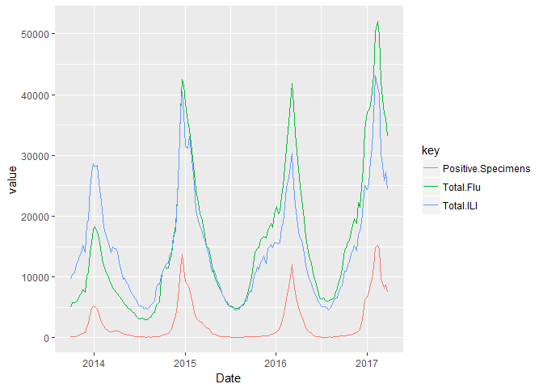

However, this peak and trough pattern differs somewhat for the weekly\_shipments variable, as shown in the graph below. Note that although the timing of the peaks for weekly\_shipments and the Total.Flu and Total.ILI variables approximately match in 2016 and 2017, there are also instances of a high value of weekly\_shipments with a low value of Flu/ILI. For example, the Flu/ILI trough of mid-2016 corresponds to relatively high shipments volume. Also, in 2015, the highest value of shipments occurred after the peak at the beginning of the year.

Per the VP of Active Pharmaceutical Ingredient (API) Sales at the company, these periods of high demand outside of the flu season may be due to the fact that pharmacies restock in July in preparation for the upcoming cold/flu season. This would drive increased demand in weekly\_shipments since the manufacturer would need more ingredients for Tylenol to replenish depleted finished good inventories.

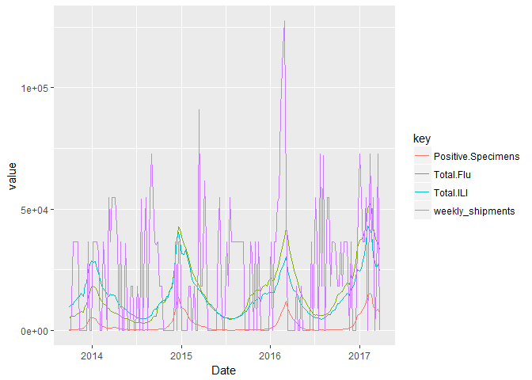

To further illustrate this point, a Pearson correlation matrix is shown below. Note that all the pairwise correlations between Total.ILI, Total.Flu, and Positive.Specimens are greater than 0.9, which suggest that multicollinearity could be present if more than one are included in the model. Unfortunately, the correlations between all of the explanatory variables and the dependent variable weekly\_shipments are quite low. This raises the question of whether these variables are truly explanatory in regards to the weekly\_shipments.

|                      |  weekly\_shipments|  Total.ILI|  Total.Flu|  weekly\_tylenol\_vec|  Positive.Specimens|
|----------------------|------------------:|----------:|----------:|---------------------:|-------------------:|
| weekly\_shipments    |          1.0000000|  0.0906891|  0.1290264|             0.0221943|           0.1764231|
| Total.ILI            |          0.0906891|  1.0000000|  0.9062295|             0.1742167|           0.9241032|
| Total.Flu            |          0.1290264|  0.9062295|  1.0000000|             0.2514906|           0.9221426|
| weekly\_tylenol\_vec |          0.0221943|  0.1742167|  0.2514906|             1.0000000|           0.2420226|
| Positive.Specimens   |          0.1764231|  0.9241032|  0.9221426|             0.2420226|           1.0000000|

The question of whether the explanatory variables actually explain any variation in the dependent variable is visually illustrated below with scatterplots. At first glance, it appears that the relationship depicted on these scatterplots could best be represented with an almost horizontal line, implying little correlation.

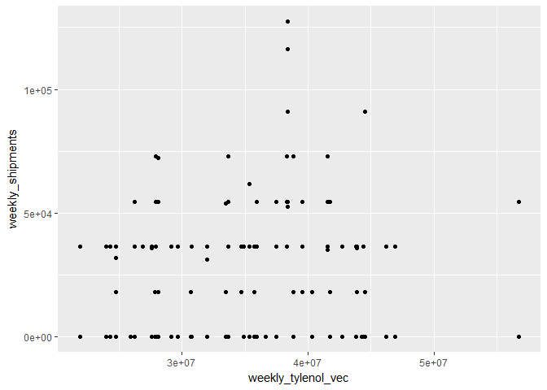 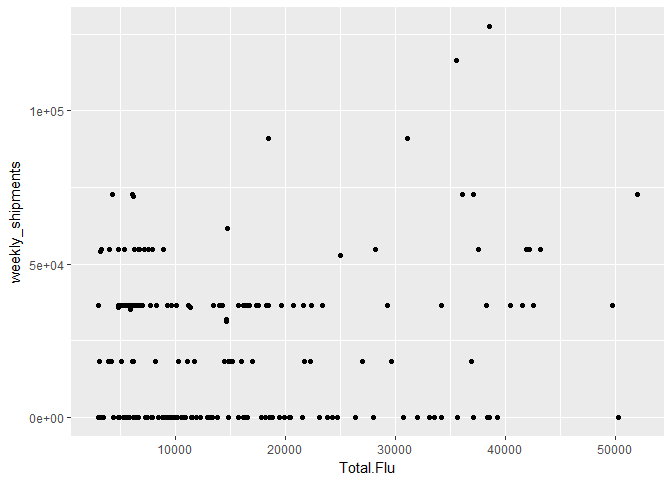 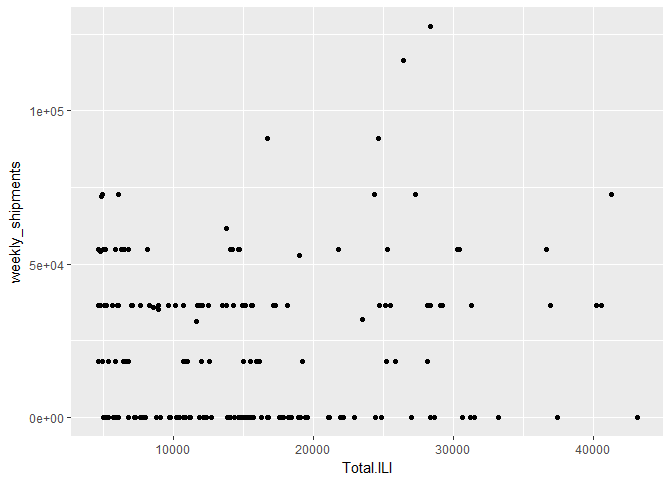 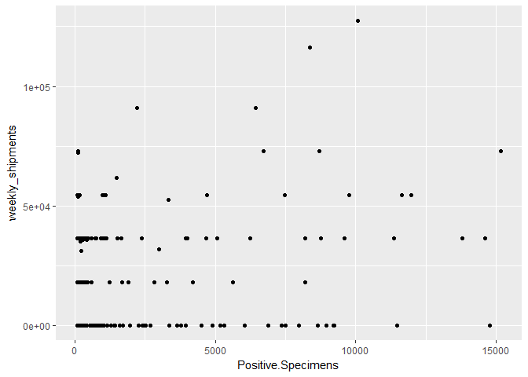

Finally, below are histograms of the dependent and independent variables. The variables do not appear to be normally distributed and seem skewed toward their lower values. This should not be problematic for linear regression since that method does not require an assumption of normality in the variables, but rather that the errors are independently and identically distributed.

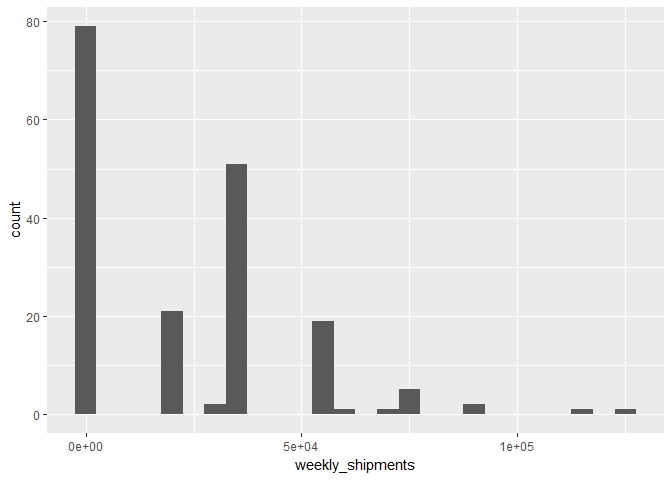 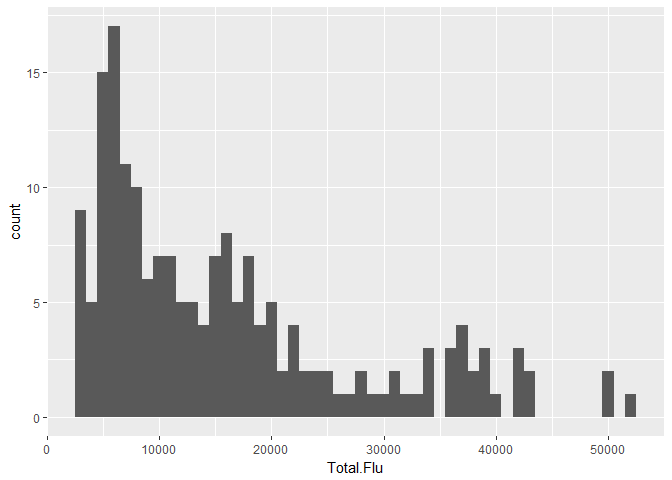 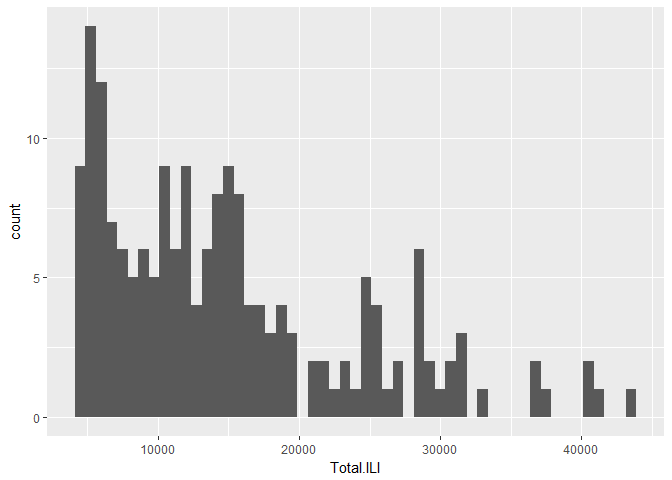 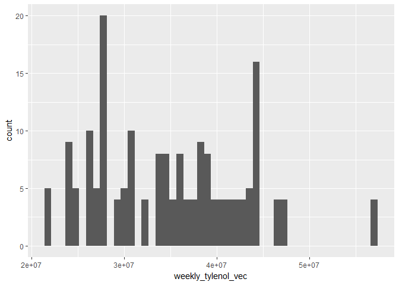 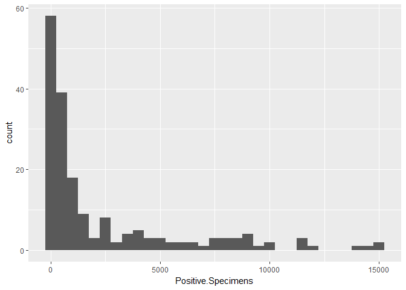

Theory and Modeling Approach
----------------------------

As discussed earlier, the dependent variable is quantity demanded of an acetaminophen ingredient of Tylenol Extra Strength 500 mg. Thus, it seems plausible that units of Tylenol sold would be correlated with the quantity my company's customer demands. If the manufacturer sees that their finished goods inventories of Tylenol are decreasing due to increased sales to retail pharmacies (i.e, the channels), they will manufacture more Tylenol to restock their finished goods inventories. Thus, increased sales of Tylenol could be a leading indicator of demand for the dependent variable. The flu season - Influenza-like Illness, influenza cases, etc. - is also considered to be a predictor of the dependent variable. This correlation is possibly similar to the Tylenol correlation, but may have a different, measurable correlation. At this point, it is not determined if Total.ILI, Total.Flu (specimens tested for flu), and Positive.Specimens each have separate, measurable correlations, so these will be tested both together and separately in the model. Another possible predictor for demand of the dependent variable is its historical demand. This seems reasonable since the demand is at least somewhat cyclical. The demand, although sometimes sporadic, is often the same amount or multiples of that amount. The data are all continuous, and the independent variables presumably explain some of the variation in the dependent variable. Also, based on the scatterplots, the relationships between the variables look approximately linear and not polynomial. Thus, a linear regression model may work well for this data. However, transformations of the variables, such as logarithmic, differencing, etc., will also be considered.
